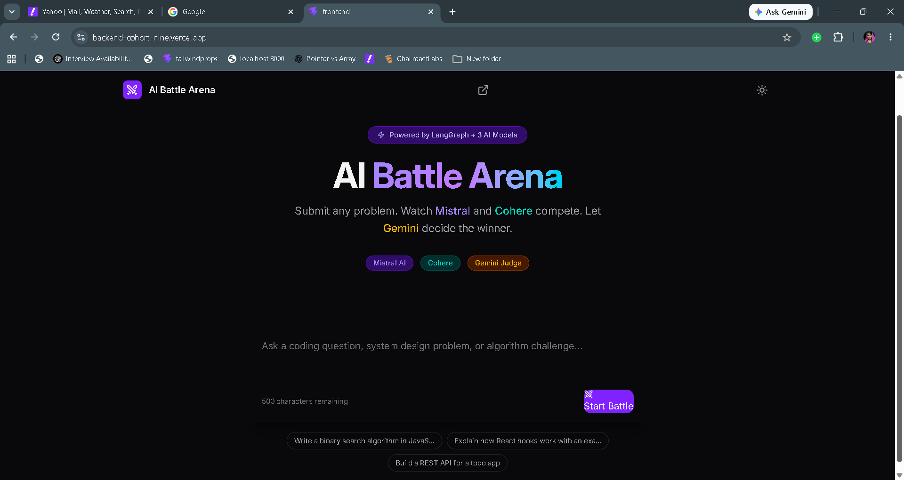
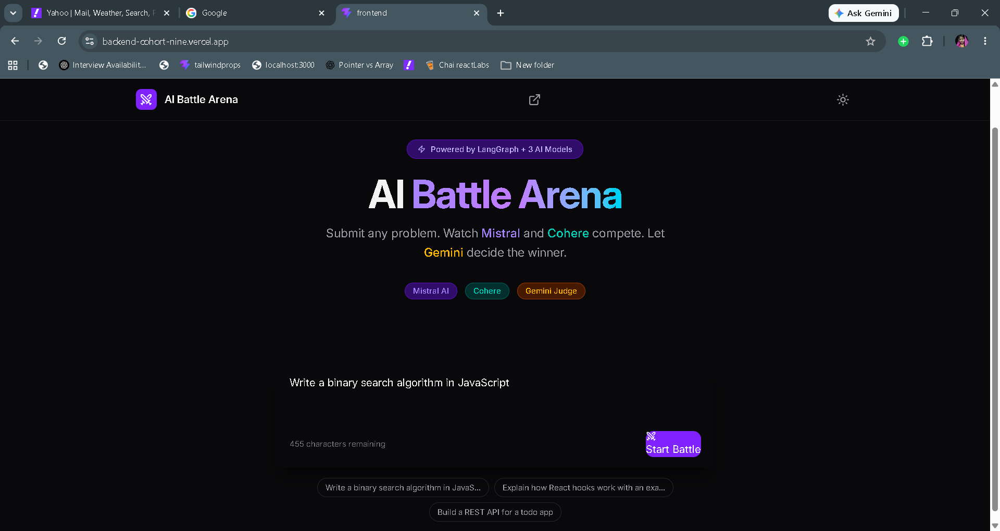
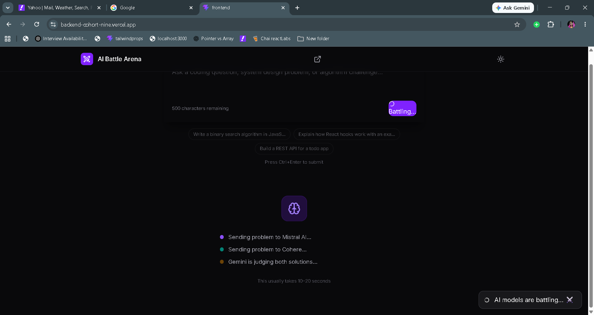
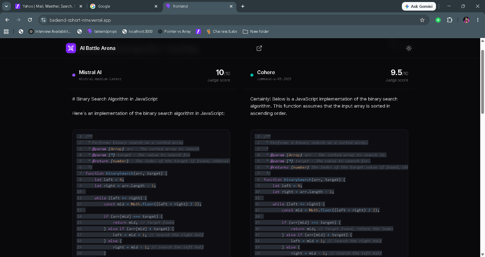
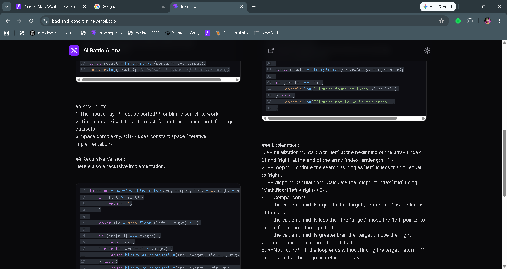
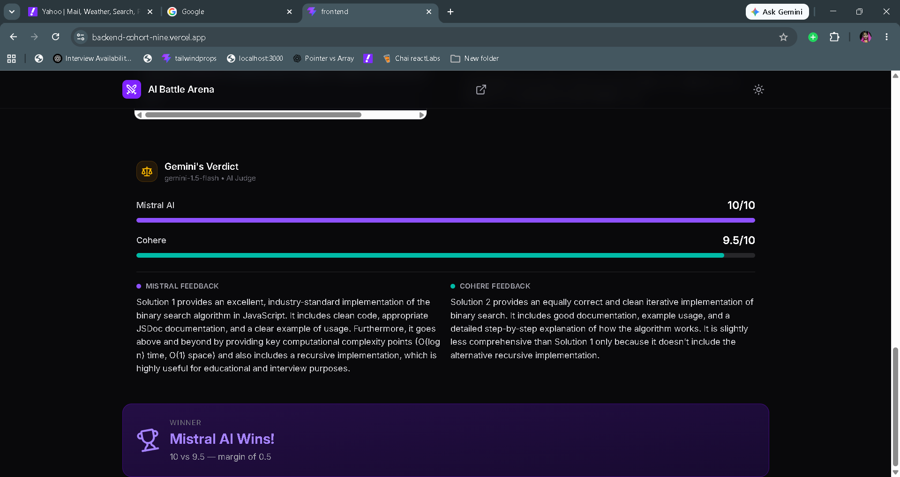
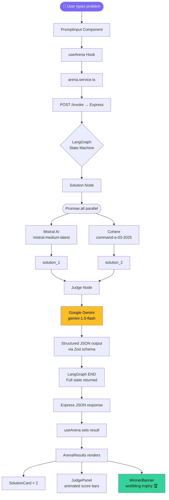

<div align="center">

# ⚔️ AI Battle Arena

### *Watch AI models compete. Let intelligence win.*

[](https://backend-cohort-nine.vercel.app/)
[](https://battle-ai-arena-api.onrender.com/)
[](https://opensource.org/licenses/MIT)
[](https://www.typescriptlang.org/)
[](https://reactjs.org/)
[](https://nodejs.org/)


</div>

---

<div align="center">

**AI Battle Arena** is a production-grade, full-stack AI comparison platform where Large Language Models go head-to-head on any programming challenge. Submit a prompt, watch **Mistral AI** and **Cohere** generate competing solutions in real time, and let **Google Gemini** act as an impartial judge — scoring and explaining the winner.

Built with **React + TypeScript + Vite** on the frontend and a **Node.js + Express + LangGraph** AI orchestration pipeline on the backend.

</div>

---

## 🌐 Live Demo

| Service | URL | Platform |
|:--------|:----|:---------|
| 🎨 **Frontend** | [backend-cohort-nine.vercel.app](https://backend-cohort-nine.vercel.app/) | Vercel |
| 🔌 **Backend API** | [battle-ai-arena-api.onrender.com](https://battle-ai-arena-api.onrender.com/) | Render |

> **Note:** The backend is hosted on Render's free tier. The first request after 15 minutes of inactivity may take 30–50 seconds to wake up. Subsequent requests are fast.

---

## 📸 Screenshots

<details>
<summary><strong>Click to view screenshots</strong></summary>

<br/>

**Hero / Landing Screen**
```
[ Screenshot placeholder — Hero section with animated headline and prompt input ]
```



**Battle in Progress**
```
[ Screenshot placeholder — Loading animation with step-by-step AI status ]
```

**Battle Results — Side by Side**
```
[ Screenshot placeholder — Mistral vs Cohere solutions with syntax-highlighted code ]
```


**Judge Panel**
```
[ Screenshot placeholder — Gemini's verdict with animated score bars ]
```




**Winner Announcement**
```
[ Screenshot placeholder — Winner banner with trophy animation ]
```


</details>

---

## ✨ Features

- ⚔️ **Side-by-side AI comparison** — Mistral AI and Cohere compete on the same prompt simultaneously
- 🧠 **LangGraph AI orchestration** — stateful multi-step AI pipeline with parallel model execution
- ⚖️ **Gemini-powered judge** — structured scoring (0–10) with detailed reasoning for each solution
- 🎨 **Modern UI** — dark-first design with Tailwind CSS, glassmorphism cards, and gradient typography
- 🌀 **Framer Motion animations** — staggered hero, loading steps, animated score bars, spring winner banner
- 💻 **Syntax-highlighted code** — AI code blocks rendered with `react-syntax-highlighter` + copy button
- 🔔 **Toast notifications** — real-time feedback via `react-hot-toast` for loading, success, and errors
- 🌓 **Dark / light mode toggle** — persisted across interactions
- 📱 **Fully responsive** — works on mobile, tablet, and desktop
- 🔒 **Type-safe full stack** — TypeScript on both frontend and backend with Zod schema validation
- 🛡️ **Production error handling** — layered error boundaries on frontend, try/catch with typed errors on backend
- 🚀 **Fast builds** — Vite frontend, `tsx` dev server with hot reload
- 🧩 **Clean architecture** — services layer, custom hooks, pages pattern, separated AI orchestration

---

## 🛠️ Tech Stack

### Frontend

| Technology | Version | Purpose |
|:-----------|:--------|:--------|
| [React](https://reactjs.org/) | 18.x | UI component framework |
| [TypeScript](https://www.typescriptlang.org/) | 5.x | Type safety across the entire frontend |
| [Vite](https://vitejs.dev/) | 5.x | Build tool and dev server |
| [Tailwind CSS](https://tailwindcss.com/) | 3.x | Utility-first styling |
| [Framer Motion](https://www.framer.com/motion/) | 11.x | Animations and transitions |
| [Axios](https://axios-http.com/) | 1.x | HTTP client for API requests |
| [Lucide React](https://lucide.dev/) | latest | Icon library |
| [react-syntax-highlighter](https://github.com/react-syntax-highlighter/react-syntax-highlighter) | latest | Syntax-highlighted code blocks |
| [react-hot-toast](https://react-hot-toast.com/) | latest | Toast notification system |
| [shadcn/ui](https://ui.shadcn.com/) | latest | Accessible component primitives |

### Backend

| Technology | Version | Purpose |
|:-----------|:--------|:--------|
| [Node.js](https://nodejs.org/) | 20.x | JavaScript runtime |
| [Express.js](https://expressjs.com/) | 4.x | HTTP server and routing |
| [TypeScript](https://www.typescriptlang.org/) | 5.x | Type safety on the backend |
| [LangGraph](https://langchain-ai.github.io/langgraphjs/) | latest | AI workflow orchestration (state machine) |
| [LangChain Core](https://js.langchain.com/) | latest | Shared message types and model interfaces |
| [Mistral AI](https://docs.mistral.ai/) | latest | Competitor model 1 — generates solution_1 |
| [Cohere](https://docs.cohere.com/) | latest | Competitor model 2 — generates solution_2 |
| [Google Gemini](https://ai.google.dev/) | latest | Judge model — scores both solutions |
| [Zod](https://zod.dev/) | 3.x | Runtime schema validation for AI structured output |
| [CORS](https://www.npmjs.com/package/cors) | latest | Cross-origin resource sharing |
| [dotenv](https://www.npmjs.com/package/dotenv) | latest | Environment variable management |
| [tsx](https://www.npmjs.com/package/tsx) | latest | TypeScript execution for dev server |

### Infrastructure

| Service | Purpose |
|:--------|:--------|
| [Vercel](https://vercel.com/) | Frontend hosting and global CDN |
| [Render](https://render.com/) | Backend Node.js server hosting |
| [GitHub](https://github.com/) | Source control and CI/CD trigger |

---

## 🏗️ System Architecture

```
┌─────────────────────────────────────────────────────────────────┐
│                        USER'S BROWSER                           │
│                                                                 │
│  React App (Vercel CDN)                                         │
│  ┌──────────────┐    ┌──────────────┐    ┌──────────────────┐  │
│  │  ArenaPage   │───▶│  useArena()  │───▶│  arena.service   │  │
│  │  (pages/)    │    │  (hook)      │    │  axios.post()    │  │
│  └──────────────┘    └──────────────┘    └────────┬─────────┘  │
│                                                   │             │
└───────────────────────────────────────────────────┼─────────────┘
                                                    │ HTTPS POST /invoke
                                                    ▼
┌─────────────────────────────────────────────────────────────────┐
│                   EXPRESS SERVER (Render)                        │
│                                                                 │
│  POST /invoke                                                   │
│       │                                                         │
│       ▼                                                         │
│  runGraph(problem)                                              │
│       │                                                         │
│       ▼                                                         │
│  ┌─────────────────────────────────────────────────────────┐   │
│  │              LANGGRAPH STATE MACHINE                     │   │
│  │                                                         │   │
│  │  START ──▶ [Solution Node] ──▶ [Judge Node] ──▶ END   │   │
│  │                  │                    │                 │   │
│  │           Promise.all()         Gemini Judge            │   │
│  │           ┌──────┴──────┐      .withStructuredOutput()  │   │
│  │           ▼             ▼                               │   │
│  │        Mistral       Cohere                             │   │
│  │      solution_1    solution_2                           │   │
│  └─────────────────────────────────────────────────────────┘   │
│                                                                 │
│  State: { problem, solution_1, solution_2, judge }             │
│       │                                                         │
│       ▼                                                         │
│  JSON Response ──▶ back to browser                             │
└─────────────────────────────────────────────────────────────────┘
                         │            │            │
                         ▼            ▼            ▼
                   Mistral API   Cohere API   Gemini API
                   (solution_1) (solution_2)  (judge scores)
```

### How it works step by step

1. User types a problem in the React UI and clicks **Start Battle**
2. `PromptInput` calls `onSubmit` → `useArena` hook → `arena.service.ts`
3. Axios sends `POST /invoke` with `{ input: "user's problem" }` to the Express server on Render
4. Express calls `runGraph(input)` which starts the LangGraph state machine
5. The **Solution Node** calls Mistral and Cohere **in parallel** via `Promise.all()` — saving ~5 seconds
6. Both responses are stored in the shared LangGraph state
7. The **Judge Node** passes both solutions to Gemini with `.withStructuredOutput(zodSchema)` — forcing a structured JSON score instead of freeform text
8. LangGraph returns the complete state: `{ problem, solution_1, solution_2, judge }`
9. Express sends the result back as JSON
10. React renders the solution cards, animated score bars, and winner banner

---

## 🔄 Workflow Diagram



---

## 📁 Project Structure

```
langgraph-battle-ai-arena/
│
├── 📁 Backend/
│   ├── 📄 package.json              # Dependencies and scripts
│   ├── 📄 tsconfig.json             # TypeScript configuration
│   ├── 📄 .env                      # Environment variables (never commit)
│   └── 📁 src/
│       ├── 📄 server.ts             # Entry point — starts Express server
│       ├── 📄 app.ts                # Express app — routes, middleware, CORS
│       ├── 📁 ai/
│       │   ├── 📄 model.ai.ts       # Model definitions (Mistral, Cohere, Gemini)
│       │   └── 📄 graph.ai.ts       # LangGraph state machine — nodes and edges
│       └── 📁 config/
│           └── 📄 config.ts         # Loads and exports environment variables
│
├── 📁 Frontend/
│   ├── 📄 package.json              # Dependencies and scripts
│   ├── 📄 tsconfig.json             # TypeScript configuration
│   ├── 📄 vite.config.ts            # Vite configuration with dev proxy
│   ├── 📄 tailwind.config.js        # Tailwind CSS with dark mode
│   ├── 📄 index.html                # Single HTML file (SPA entry point)
│   ├── 📄 .env                      # VITE_API_BASE_URL (never commit)
│   └── 📁 src/
│       ├── 📄 main.tsx              # React entry — mounts App into DOM
│       ├── 📄 App.tsx               # Root component — layout shell
│       ├── 📄 index.css             # Tailwind directives + global styles
│       ├── 📁 types/
│       │   └── 📄 arena.types.ts    # TypeScript interfaces for all API data
│       ├── 📁 config/
│       │   └── 📄 api.ts            # API base URL and endpoint constants
│       ├── 📁 services/             # HTTP layer — no React code
│       │   └── 📄 arena.service.ts  # axios.post('/invoke') → ArenaResult
│       ├── 📁 utils/                # Pure functions — no React
│       │   └── 📄 parseContent.ts   # Splits AI markdown into text + code
│       ├── 📁 hooks/                # Custom React hooks
│       │   └── 📄 useArena.ts       # Status/result/runBattle/reset state machine
│       ├── 📁 pages/                # Route-level components
│       │   └── 📄 ArenaPage.tsx     # Connects useArena hook → components
│       └── 📁 components/
│           ├── 📁 layout/
│           │   ├── 📄 Header.tsx        # Sticky nav + dark mode toggle
│           │   └── 📄 PageWrapper.tsx   # Max-width centred container
│           ├── 📁 arena/
│           │   ├── 📄 HeroSection.tsx   # Animated headline
│           │   ├── 📄 PromptInput.tsx   # Textarea + submit button
│           │   ├── 📄 LoadingState.tsx  # Step-by-step loading animation
│           │   ├── 📄 SolutionCard.tsx  # Single model's response card
│           │   ├── 📄 JudgePanel.tsx    # Gemini scores + reasoning
│           │   ├── 📄 WinnerBanner.tsx  # Trophy + winner announcement
│           │   └── 📄 ArenaResults.tsx  # Composes the 4 result components
│           ├── 📁 shared/
│           │   └── 📄 CodeBlock.tsx     # Syntax highlight + copy button
│           └── 📁 ui/                   # shadcn/ui generated components
│               ├── 📄 button.tsx
│               └── 📄 badge.tsx
│
└── 📄 README.md
```

---

## 🚀 Getting Started

### Prerequisites

Make sure you have these installed before starting:

```bash
node --version   # v18.x or higher required
npm --version    # v9.x or higher
git --version    # any recent version
```

### 1. Clone the Repository

```bash
git clone https://github.com/supriya759694/langgraph-battle-ai-arena.git
cd langgraph-battle-ai-arena
```

### 2. Set Up the Backend

```bash
# Enter the Backend folder
cd Backend

# Install all dependencies
npm install

# Create your environment file
cp .env.example .env   # or manually create .env (see section below)
```

### 3. Set Up the Frontend

```bash
# Open a NEW terminal, navigate to Frontend
cd Frontend

# Install all dependencies
npm install

# Create your environment file
cp .env.example .env   # or manually create .env
```

### 4. Configure Environment Variables

**Backend `.env`** (inside the `Backend/` folder):

```env
# Your Express server port
PORT=3000

# Google Gemini — https://aistudio.google.com/app/apikey
GOOGLE_API_KEY=your_google_api_key_here

# Mistral AI — https://console.mistral.ai/
MISTRALAI_API_KEY=your_mistral_api_key_here

# Cohere — https://dashboard.cohere.com/api-keys
COHERE_API_KEY=your_cohere_api_key_here
```

**Frontend `.env`** (inside the `Frontend/` folder):

```env
# Points to your local backend during development
VITE_API_BASE_URL=http://localhost:3000
```

### 5. Run the Development Servers

Open **two separate terminals**:

**Terminal 1 — Backend:**
```bash
cd Backend
npm run dev
# Expected output: Server running on http://localhost:3000
```

**Terminal 2 — Frontend:**
```bash
cd Frontend
npm run dev
# Expected output: Local: http://localhost:5173
```

### 6. Open the App

Visit `http://localhost:5173` in your browser. Type any programming problem and click **Start Battle** ⚔️

---

## 🔐 Environment Variables Reference

### Backend Variables

| Variable | Required | Description | Where to get it |
|:---------|:--------:|:------------|:----------------|
| `PORT` | ✅ | Port the Express server listens on | Set to `3000` locally |
| `GOOGLE_API_KEY` | ✅ | Google Gemini API key (judge model) | [aistudio.google.com/app/apikey](https://aistudio.google.com/app/apikey) |
| `MISTRALAI_API_KEY` | ✅ | Mistral AI API key (competitor model 1) | [console.mistral.ai](https://console.mistral.ai/) |
| `COHERE_API_KEY` | ✅ | Cohere API key (competitor model 2) | [dashboard.cohere.com/api-keys](https://dashboard.cohere.com/api-keys) |

### Frontend Variables

| Variable | Required | Description | Example value |
|:---------|:--------:|:------------|:--------------|
| `VITE_API_BASE_URL` | ✅ | Base URL of your backend API | `http://localhost:3000` (dev) / `https://your-api.onrender.com` (prod) |

> ⚠️ **Security:** Never commit `.env` files. All variables in this project are backend-only (AI keys stay server-side). The only frontend variable (`VITE_API_BASE_URL`) is a public URL, not a secret.

---

## 📡 API Endpoints

### Health Check

```http
GET /
```

**Response:**
```json
{
  "problem": "Write a code for Factorial function in js",
  "solution_1": "...",
  "solution_2": "...",
  "judge": {
    "solution_1_score": 9,
    "solution_2_score": 8,
    "solution_1_reasoning": "...",
    "solution_2_reasoning": "..."
  }
}
```

---

### Run a Battle

```http
POST /invoke
Content-Type: application/json
```

**Request Body:**
```json
{
  "input": "Write a binary search algorithm in JavaScript"
}
```

**Success Response** `200 OK`:
```json
{
  "message": "Graph executed successfully",
  "success": true,
  "result": {
    "problem": "Write a binary search algorithm in JavaScript",
    "solution_1": "# Binary Search in JavaScript\n\n```javascript\nfunction binarySearch(arr, target) {\n  let left = 0;\n  let right = arr.length - 1;\n  ...\n}\n```\n\nTime complexity: O(log n)",
    "solution_2": "Binary search is an efficient algorithm...\n\n```javascript\nconst binarySearch = (arr, target) => {\n  ...\n};\n```",
    "judge": {
      "solution_1_score": 9,
      "solution_2_score": 8,
      "solution_1_reasoning": "Solution 1 provides a clean iterative approach with excellent complexity analysis and edge case handling.",
      "solution_2_reasoning": "Solution 2 uses modern arrow function syntax and is well-structured, but lacks some commentary."
    }
  }
}
```

**Error Response** `400 Bad Request`:
```json
{
  "message": "input is required",
  "success": false
}
```

**Error Response** `500 Internal Server Error`:
```json
{
  "message": "API error message from the failing model provider",
  "success": false
}
```

---

## 📦 Deployment

### Backend → Render

1. Push your code to GitHub
2. Go to [render.com](https://render.com) → **New +** → **Web Service**
3. Connect your GitHub repository
4. Set configuration:

   | Field | Value |
   |:------|:------|
   | Root Directory | `Backend` |
   | Build Command | `npm install && npm run build` |
   | Start Command | `npm start` |
   | Instance Type | Free |

5. Add environment variables in Render's **Environment** tab:
   - `GOOGLE_API_KEY`
   - `MISTRALAI_API_KEY`
   - `COHERE_API_KEY`
   - `NODE_VERSION` = `20.11.0`

6. Click **Deploy** and copy your `.onrender.com` URL

### Frontend → Vercel

1. Go to [vercel.com](https://vercel.com) → **Add New** → **Project**
2. Import your GitHub repository
3. Set configuration:

   | Field | Value |
   |:------|:------|
   | Root Directory | `Frontend` |
   | Framework Preset | Vite (auto-detected) |
   | Build Command | `npm run build` |
   | Output Directory | `dist` |

4. Add environment variable:
   - `VITE_API_BASE_URL` = `https://your-api-name.onrender.com` (no trailing slash)

5. Click **Deploy** and copy your `.vercel.app` URL

### Connecting Frontend ↔ Backend

After both are deployed, update your backend's CORS config in `Backend/src/app.ts`:

```ts
app.use(cors({
  origin: [
    "http://localhost:5173",
    "https://your-app-name.vercel.app"   // ← your real Vercel URL
  ],
  methods: ["GET", "POST"],
  credentials: true,
}));
```

Push the change — Render redeploys automatically.

---

## ⚡ Performance

- **Parallel AI calls** — Mistral and Cohere are called with `Promise.all()` rather than sequentially, reducing total wait time by ~50% (from ~10-15s sequential to ~5-8s parallel)
- **Vite code splitting** — frontend bundle is split into vendor and app chunks, reducing initial load size
- **Tailwind CSS purging** — unused utility classes are removed at build time, keeping the CSS bundle minimal
- **Zod schema validation** — structured output from Gemini is validated at runtime, preventing malformed data from reaching the UI
- **useCallback memoization** — `runBattle` and `reset` functions in `useArena` are memoised to prevent unnecessary re-renders
- **Framer Motion lazy mounting** — animations only trigger when components enter the viewport, not on initial page load

---

## 🛡️ Error Handling

### Frontend

| Scenario | Handling |
|:---------|:---------|
| Empty input submitted | Button disabled, `toast.error()` notification |
| Backend unreachable | `AxiosError` caught, "Cannot reach server" message displayed |
| Backend returns 4xx | Server error message extracted and shown via toast |
| Backend returns 5xx | Generic error message with retry option |
| React render error | `status === 'error'` state shows friendly error UI with reset button |

### Backend

| Scenario | Handling |
|:---------|:---------|
| Missing `input` field | 400 response with `"input is required"` |
| Model API failure | Caught in try/catch, 500 response with the actual error message |
| Invalid API key | 401 from provider caught and forwarded as 500 with readable message |
| LangGraph node crash | Error propagates to Express error handler, logged and returned |

---

## 🔮 Future Improvements

| Feature | Description | Priority |
|:--------|:------------|:---------|
| 🔐 **Authentication** | User accounts to save battle history and preferences | High |
| 📜 **Battle History** | Persistent storage of past battles with filtering | High |
| 🗳️ **User Voting** | Let users vote on which solution they prefer independently of the AI judge | High |
| 🌊 **Streaming Responses** | Token-by-token streaming so solutions appear as they generate | High |
| 🤖 **More AI Models** | Add GPT-4, Claude, Llama, and others as competitors | Medium |
| 📚 **Prompt Library** | Pre-built prompts for common interview questions, algorithms, design patterns | Medium |
| 💻 **Code Execution** | Actually run the generated code and display output | Medium |
| 🚦 **Rate Limiting** | Per-IP request throttling to prevent API cost abuse | Medium |
| 🗄️ **Caching** | Redis cache for identical prompts — skip AI calls for repeated questions | Medium |
| 📊 **Analytics Dashboard** | Win rates per model, most popular problem categories, average scores | Low |
| 🌐 **Multi-language Support** | Support for Python, Java, C++ in the prompt and response rendering | Low |
| 🔌 **Webhooks** | Notify users when long-running battles complete | Low |

---

## 🤝 Contributing

Contributions are welcome! Here's how to get started:

1. **Fork** the repository on GitHub
2. **Clone** your fork locally:
   ```bash
   git clone https://github.com/YOUR_USERNAME/langgraph-battle-ai-arena.git
   ```
3. **Create a feature branch:**
   ```bash
   git checkout -b feature/your-feature-name
   ```
4. **Make your changes** and test them locally
5. **Commit** with a clear message:
   ```bash
   git commit -m "feat: add streaming response support"
   ```
6. **Push** to your fork:
   ```bash
   git push origin feature/your-feature-name
   ```
7. **Open a Pull Request** on the original repo — describe what you changed and why

### Commit Message Convention

This project follows [Conventional Commits](https://www.conventionalcommits.org/):

| Prefix | Use for |
|:-------|:--------|
| `feat:` | New feature |
| `fix:` | Bug fix |
| `docs:` | Documentation changes |
| `style:` | Formatting, no logic change |
| `refactor:` | Code restructuring |
| `test:` | Adding or fixing tests |

---


## 👩‍💻 Author

<div align="center">

**Supriya Bhowmick**

*Full Stack Developer | React • TypeScript • Node.js • LangGraph • AWS*

[](https://www.linkedin.com/in/supriya-bhowmick-b31181227/)
[](https://github.com/supriya759694)


</div>

---

## 💬 Support

If this project helped you or impressed you:

- ⭐ **Star this repository** — it helps others discover the project and supports continued development
- 🐛 **Found a bug?** [Open an issue](https://github.com/supriya759694/langgraph-battle-ai-arena/issues)
- 💡 **Have an idea?** [Start a discussion](https://github.com/supriya759694/langgraph-battle-ai-arena/discussions)
- 📧 **Want to connect?** Reach out on [LinkedIn](https://www.linkedin.com/in/supriya-bhowmick-b31181227/)

---

<div align="center">

Made with ❤️ and TypeScript by [Supriya Bhowmick](https://github.com/supriya759694)

*Powered by Mistral AI × Cohere × Google Gemini × LangGraph*

</div>
